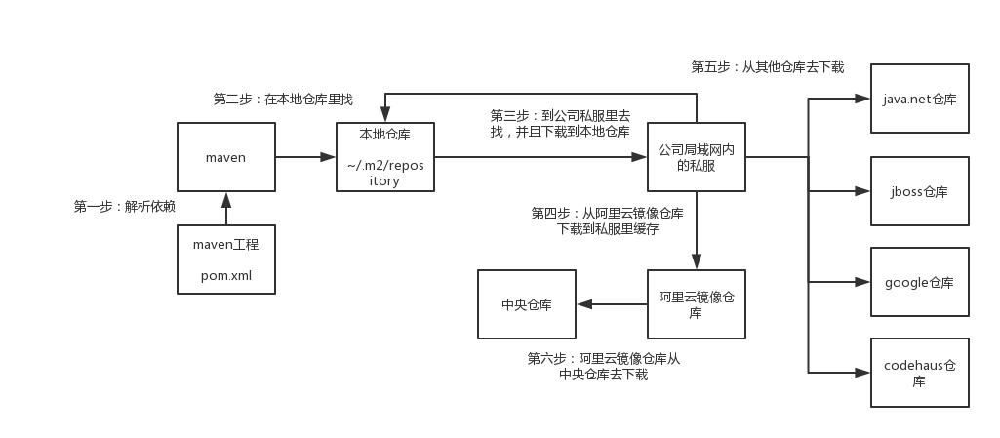

# 						                                                   **Maven**

# 1 解决依赖冲突

## 1.1 什么是依赖冲突

​	A包--->C1.0
​	B包--->D--->C2.0

​	根据最近原则，自动选择C1.0,当用到C2.0的时候就会报错


## 	1.2 怎么解决？

​					mvn dependency:tree 用dependency插件的tree goal执行,进行依赖链条分析（idea插件：Maven Helper)

​					把A的C1.0手动排除，就会自动选择C2.0

```java
		<dependency>
			<groupId>A</groupId>
			<artifactId>A</artifactId>
			<version>1.0</version>
			<exlusions>
				<exclusion>
            		<groupId>C</groupId>
                	<artifactId>C</artifactId>
                </exclusion>
			</exlusions>
		</dependency>
```


# 2.多重仓库



##  2.1 本地仓库

​		Windows 	默认的仓库目录 		~/.m2/repository

​		Linux  	默认路径是			/home/root/.m2/repository

​		在~/.m2/settings.xml配置文件里，可以设置：

​		<localRepository>某路径</localRepository>

## 2.2 默认的中央仓库

​		apache-maven-3.5.2\lib\maven-model-builder-3.5.2.jar\org\apache\maven\mode里面的pom-4.0.0.xml记录着中央仓库的地址

​		https://repo.maven.apache.org/maven2

## 2.3 其它远程仓库

​		java.net，google，codehaus，jboss，还有一些其他公司自己搞的Maven仓库，有少数的依赖包可能在中央仓库里找不到，只在其他仓库里。


## 2.4  镜像仓库

​		比如说，像中央仓库在国外，很慢的，直接从中央仓库下载的话，是**很慢的**，所以一般国内的一些大型的互联网公司，**阿里云**，会搞一个**镜像仓库**，完全跟中央仓库**一模一样**的，代理了中央仓库所有的请求。你可以直接从阿里云镜像仓库去请求，如果有就直接返回了，国内网络的速度很快的，上百倍；阿里云如果自己没有，就会去从国外的中央仓库去下载。

##  2.6 搭建私服Nexus

### 		2.6.1 下载

​			从http://nexus.sonatype.org/downloads/下载最新版本的nexus

​			将bundle包解压缩后放在某个目录下，包含两个子目录

​					nexus-3.6.0-02：这里包含nexus运行需要的文件
​					sonatype-work：包含nexus的配置文件、日志文件、仓库文件

### 		2.6.2 启动

​			通过cmd启动			

​			进入目录nexus-3.6.0-02-win64\nexus-3.6.0-02\bin\ ,cmd  输入nexus.exe/run，等待3-5分钟（因机而异），出现下图即启动成功，

​			打开浏览器访问http://localhost:8081/

​			此为前端启动，ctrl+c			退出

​				

​		

### 	2.6.3 修改配置

​			两个配置文件

​				bin/nexus.vmoptions

​				etc/nexus-default.properties  里面可以修改端口号

### 	2.6.4 账号

​			nexus的默认管理员账号和密码是：admin、admin123

### 2.6.5  nexus中的仓库

​	nexus安装好之后本身就内置了一些仓库

​	

​	包括四种仓库类型

​		hosted：宿主仓库，这个仓库，是用来让你把你公司内部的发布包部署到这个仓库里来，然后公司内的其他人就可以从这个宿主仓库里下载依赖去使用		   		proxy：  代理仓库，这个仓库不是用来给你公司内部的发布包部署的，是代理了公司外部的各种仓库的，比如说java.net，codehaus，jboss仓库，最最重要						的，就是代理了公司外部的中央仓库，但是这里其实可以修改为nexus连接的应该是国内的阿里云镜像仓库，阿里云去连接中央仓库其他的一些常用						的仓库，java.net，jboss，googlecode，codehaus，这种仓库，现在都很少用了

​		group：仓库组，其实就是将，各种宿主仓库、代理仓库全部组成一个虚拟的仓库组，然后我们的项目只要配置依赖于一个仓库组，相当于就是可以自动连接					  仓库组对应的各种仓库

​					仓库的格式是maven1或者maven2，仓库的布局，我们之前给大家讲解过，布局格式，这里现在统一都是maven2

​	最后还有仓库的状态和路径

​		maven-central：这是maven中央仓库的代理仓库
​		maven-releases：该仓库是个宿主仓库，用于部署公司内部的release版本的发布包（类似于1.0.0,，release的意思就是你的工程已经经过了完善的测试，单										元测试，集成测试，QA测试，上生产环境使用了）到这个仓库里面，供其他同事在生产环境依赖和使用

​		maven-snapshots：该仓库是个宿主仓库，用于部署公司内部的snapshot版本的发布包到这个仓库里（如果你的某个工程还在开发过程中，测试还没结束，											但是，此时公司里其他同事也在开发一些工程，需要依赖你的包进行开发和测试，联调，此时你的工程的版本就是类似1.0.0-SNAPSHOT											这样的版本），供其他同事在开发和测试的时候使用

​		3rd party：该仓库是个宿主仓库，主要用来部署没法从公共仓库获取的第三方依赖包，比如说，你的公司依赖于第三方支付厂商的一个依赖包，那个依赖包							不是开源的，是商业的包。那么你是没有办法从maven中央仓库获取的。此时，我们可能会自己手动从支付厂商那里获取到一个jar包，下载之后							上传到私服里来，就放这个仓库里，3rd-party仓库

​	maven-public：仓库组，上面所有release仓库都在这个仓库组内

​	

### 		2.6.6  配置nexus仓库

​				maven-public仓库组：已有
​				maven-snapshots宿主仓库：已有
​				maven-releases宿主仓库：已有

​				maven-central代理仓库：从直接代理maven中央仓库，修改为代理阿里云仓库，http://maven.aliyun.com/nexus/content/groups/public

​				配置

​				

​				

​			3rd-party仓库：需要手动创建

​			.jpg)


.jpg)
.jpg)

**再次配置maven-public仓库组，将3rd-party仓库加入其中**

.jpg)


### 2.6.7 项目配置私服（在maven的settings.xml中配置）

我们现在已经有了私服了，下一步就是要将公司中的项目配置为强制从公司内的私服来下载，不允许走外网，这样可以统一收口管理。毕竟nexus私服本身也是代理了各种中央仓库，直接用nexus私服就可以。

通常会在settings.xml配置文件中，为当前机器统一配置使用的私服仓库地址，而且一般都是直接用私服中的仓库组，在settings.xml中用profiles即可。

#### 	2.6.7.1 配置settings.xml的profiles

```
<profiles>
	<profile>
		<id>nexus</id>
      	<repositories>
        		<repository>
          			<id>centrl</id>		//这里将id设置为central,会覆盖maven本身中lib\maven-model-builder-3.5.2.jar
          			<name>Nexus </name>	//\org\apache\maven\mode里面的pom-4.0.0.xml的<id>centrl</id>
      	  			<url>http://central</url>   //这里的url是无意义的，然后会转到下面的mirror的url
          			<releases><enabled>true</enabled></releases>
          			<snapshots><enabled>true</enabled></snapshots>
        		</repository>
      	</repositories>
      	<pluginRepositories>
        		<pluginRepository>
          			<id>central</id>
          			<name>Nexus Plugin Repository</name>
      				<url>http://central</url>
          			<releases><enabled>true</enabled></releases>
          			<snapshots><enabled>true</enabled></snapshots>
        		</pluginRepository>
      	</pluginRepositories>
	</profile>
</profiles>

<activeProfiles>
	<activeProfile>nexus</activeProfile>
</activeProfiles>
```

#### 	2.6.7.2 配置settings.xml的mirrors

​	除此之外，我们还需要用mirror镜像机制，来强制要求所有对远程仓库的请求，全部通过镜像走私服。所谓的镜像，就是如果某个仓库A代理了另外一个仓库	B，里面的内容完全一样，那么仓库A就是仓库B的镜像。

```
<mirrors>
	<mirror>
		<id>nexus</id>
		<mirrorOf>*</mirrorOf>
		<url>http://localhost:8081/nexus/content/groups/public</url>	//这里配置我们私服的仓库组
	</mirror>
</mirros>	
```

### 2.6.8 如何将自己的jar包上传到私服

​	nexus私服默认就是可以读的，不需要认证，公司局域网内的人都可以去配置之后拉取依赖。但是如果下一讲要进行部署的话，我们是需要有一个专用的部署账号，通过账号认证，才能部署发布包到nexus私服的。

​	nexus的权限是典型的RBAC模型，role-based access control。每个用户可以分配多个角色，每个角色分配多个权限，每个权限就是一个具体的功能，比如浏览依赖，部署发布包，等等。

#### 	2.6.8.1 设置权限

​		nexus默认有三个用户：
​			admin：管理员账号，密码是admin123
​			anonymous：如果没有给认证信息，就是这个匿名账号，可以下载依赖，查看依赖。**nexus没有登录默认是这个账号**
​			deployment：可以搜索和部署构建，就是普通的开发账号，密码是deployment123（在nexus 3.x最新版本里已经被消除掉了）

##### 		2.6.8.1.1 页面配置deployment	

​			我们光是有admin和匿名账号是不够的，我们需要创建一个专门用来部署的账号，deployment：

​				（1）涵盖所有匿名账号的权限，至少可以搜索仓库，下载依赖

​				（2）对仓库有所有的管理权限，就可以往仓库中去部署发布包

##### 

​			nexus默认的权限一般都够用了，所以我们只要设置角色和用户

​	


#### 2.6.8.2 配置自己的项目pom.xml

​	配置开发版和发布版

```
<distributionManagement>
	<repository>
		<id> nexus-releases</id>
		<name> Nexus Release Repository</name>
		<url>http://localhost:8081/nexus/content/repositories/releases/</url>
	</repository>
	<snapshotRepository>
		<id> nexus-snapshots</id>
		<name> Nexus Snapshot Repository</name>
		<url>http://localhost:8081/nexus/content/repositories/snapshots/</url>
	</snapshotRepository>
</distributionManagement>
```

#### 2.6.8.3 配置maven settings.xml的server

nexus仓库对于普通的匿名用户是只读的，也就是说，只能下载依赖，不能部署发布包，因此如果要能够部署发布包，还需要在settings.xml文件里通过<server>元素配置使用专用的部署用户，来通过认证，进行发布包的部署。

```
<servers>
	<server>
		<id>nexus-releases</id>    				//对应上面的id
		<username>deployment</username>
		<password>deployment123</password>
	</server>
	<server>
		<id>nexus-snapshots</id>				//对应上面的id
		<username>deployment</username>
		<password>deployment123</password>
	</server>
</servers>
```

#### 2.6.8.3 执行Maven deploy命令部署到私服

​	最后执行mvn clean deploy命令即可上传到私服

#### 2.6.8.4 对于第三方jar包手动上传

##### 	2.6.8.4.1 配置server

```
<servers>
	<server>
		<id>nexus-releases</id>    				//对应上面的id
		<username>deployment</username>
		<password>deployment123</password>
	</server>
	<server>
		<id>nexus-snapshots</id>				//对应上面的id
		<username>deployment</username>
		<password>deployment123</password>
	</server>
	//第三方jar配置
	<server>
		<id>nexus-3rd-party</id>
		<username>deployment</username>
		<password>deployment123</password>
	</server>
</servers>
```

##### 	2.6.8.4.2 cmd 手动上传

```
mvn deploy:deploy-file -DgroupId=com.csource -DartifactId=fastdfs-client-java -Dversion=1.24 -Dpackaging=jar -Dfile=F:\DevelopmentKit\fastdfs_client_v1.24.jar -Durl=http://localhost:8081/repository/3rd-party/ -DrepositoryId=nexus-3rd-party
```

### 2.6.9 配置一些日常定时器

nexus提供一些平常的定时任务可供配置

可选备份，压缩blob store,重建索引等


